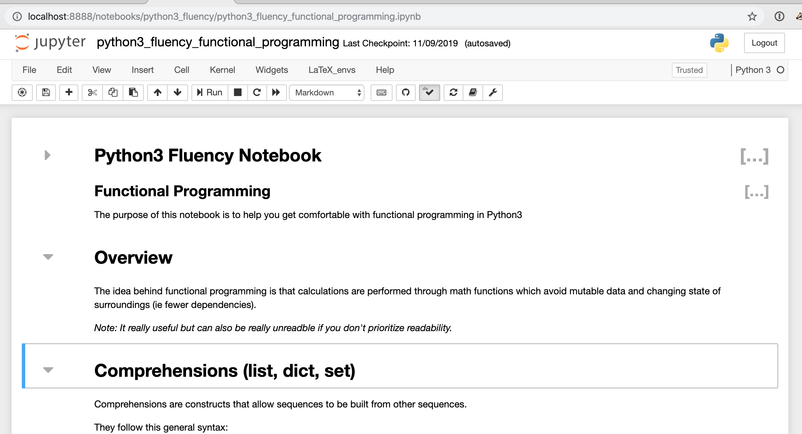

#  Python Fluency Workbooks

This repository contains workbooks to help you become fluent in [Python](https://docs.python.org/3/).

# How to use the content

You can either reference the workbook content online using the link below or run them interactively locally or using Jupyter's online tool nbviewer + binder.

* Read the workbook contents online at https://nancynobody.github.io/python3_fluency

* Clone the repo and execute the workbooks locally (find instructions here: https://jupyter.org/install)

* Launch a live notebook server with these notebooks using binder: https://nbviewer.jupyter.org/github/nancynobody/python3_fluency/tree/master/notebooks/

# Table of Contents

The workbooks are ordered and do build on each other however if you are comfortable with preceeding workbooks you can dive in wherever.

### [0. Control Flow](00.00-Control-Flow.ipynb)

* Conditional statements (if, else, etc)
* Loops

### [1. Data Structures](notebooks/01.00-Data-Structures.ipynb)

* Common Data Structures (tuples, lists, dicts, sets)
* Additional Data Structures (chainmap, counter, etc)
* Time Complexity (choosing the right data structure for the task)

### [3. Functions](notebooks/03.00-Functions.ipynb)

* Basic Functions
* Generators
* Lambda Expressions
* Partial Functions
* Nested Functions
* Positional and Keyword Arguments (args and kwargs)

### [4. Classes](notebooks/04.00-Classes.ipynb)

* Basic Classes
* Inheritance

### [5. Permutations and Combinations](notebooks/05.00-Permutations-and-Combinations.ipynb)

* Permutations
* Combinations

### [6. Logging, Errors and Exceptions](notebooks/06.00-Logging-Errors-and-Exceptions.ipynb)

* Logging
* Errors and Exceptions

### [7. Decorators](notebooks/07.00-Decorators.ipynb)

* Decorators